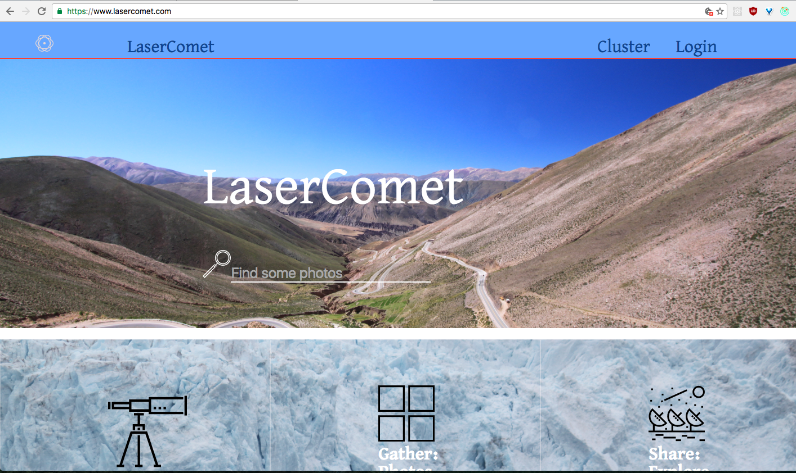
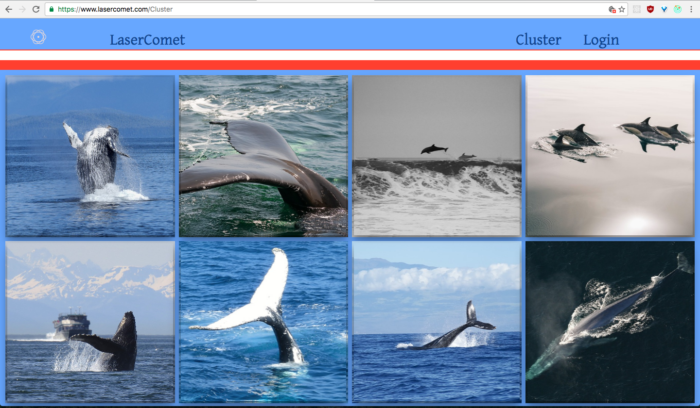
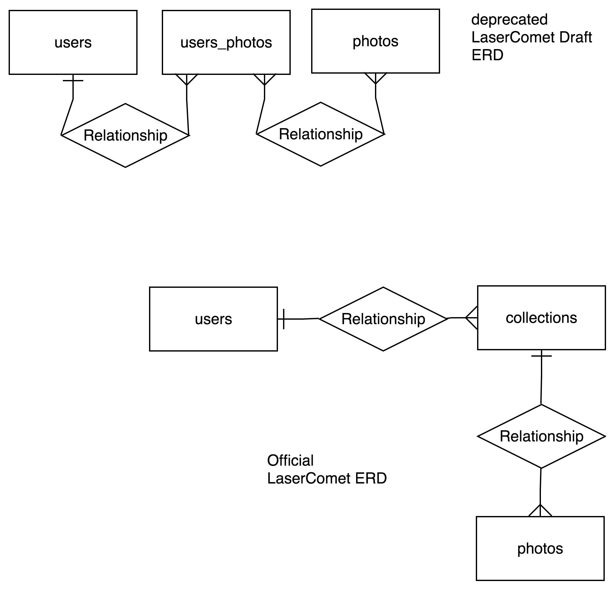

#LaserComet

Built with React, Redux, Node, Express, PostgreSQL. Utilizes the pixabay.com API to generate public domain photos. Deployed on Heroku to lasercomet.com with an SSL certificate. To build this React application I taught myself Redux and incorporated it to handle the state for my application.

###Usage

Find. Gather. Share. LaserComet is a place for people to curate photo albums without the need of a camera. A user can search and save photos to build their own album. It is also a great place to explore albums and share with other users what you have made.

Entity Relationship diagram

